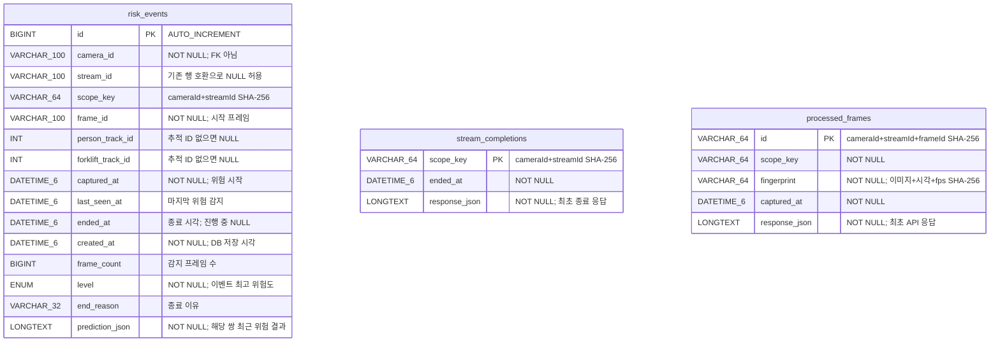

# 현재 구현 기준 ERD

- MySQL 8.4.11의 세 테이블 `SHOW CREATE TABLE` 결과로 확인했습니다 (2026-09-07).
- 외래 키 관계는 없습니다. `scope_key`는 같은 카메라·스트림의 논리적 구분 키이며 참조 제약이 아닙니다.
- `processed_frames.id`는 길이 접두사를 포함한 cameraId/streamId/frameId의 SHA-256입니다. DB 문자열 collation과 무관하게 입력의 대소문자를 구분합니다.
- 하나의 프레임 응답에는 여러 이벤트 ID가 들어갈 수 있습니다. 이 ID는 `response_json`에 보관되며 별도 조인 테이블은 없습니다.
- `risk_events.level` 실제 타입은 `ENUM('DANGER','SAFE','WARNING')`입니다. 현재 로직은 WARNING/DANGER 이벤트만 생성합니다.
- 기존 이벤트의 새 필드는 NULL 상태로 보존됩니다. API는 이 행을 LEGACY로 표시하고 병합하지 않습니다.
- `status`는 계산된 API 필드로, DB 컬럼이 아닙니다.
- `stream_completions`는 명시적으로 종료한 스트림을 기록합니다. 동일 종료 요청의 응답 재사용과 종료 후 새 프레임 거부에 사용하며 FK는 없습니다.

## 인덱스

- risk_events: PK(id), idx_risk_camera_captured(camera_id,captured_at), idx_risk_captured(captured_at), idx_risk_active(scope_key,ended_at)
- processed_frames: PK(id), idx_frame_scope_time(scope_key,captured_at)
- stream_completions: PK(scope_key)

## 검증

백엔드 테스트 25개, Python 영상 도구 테스트 8개 및 실제 MySQL API 검증을 통과했습니다. 실제 DB에서는 두 연속 프레임이
이벤트 ID 2로 합쳐지고(frame_count=2), 동일 프레임 재요청은 최초 응답을 반환했으며,
fps 변경 재요청은 409를 반환했습니다. 3초 간격 후에는 ID 2가 FRAME_GAP으로 종료되고
ID 3이 생성됐습니다. ID 1의 기존 테스트 데이터도 LEGACY로 보존됐습니다.
이 이벤트들은 모두 mock 검증 데이터입니다.

12프레임 MP4를 stride=3으로 실행해 4개 프레임이 이벤트 ID 4로 합쳐지고, EOF에서 STREAM_ENDED로 종료되는 것을 API 및 MySQL SQL 조회로 확인했습니다.

## 스키마 버전 관리

Flyway 도입으로 `flyway_schema_history` 시스템 테이블이 추가되었습니다. 위 ERD 이미지는 업무 테이블 3개를 나타냅니다. 시스템 테이블은 마이그레이션 버전·체크섬·성공 여부를 저장하며 엔티티 관계에 포함하지 않습니다. 자세한 전환 절차는 [DB 마이그레이션 안내](migrations.md)를 참조하세요.
